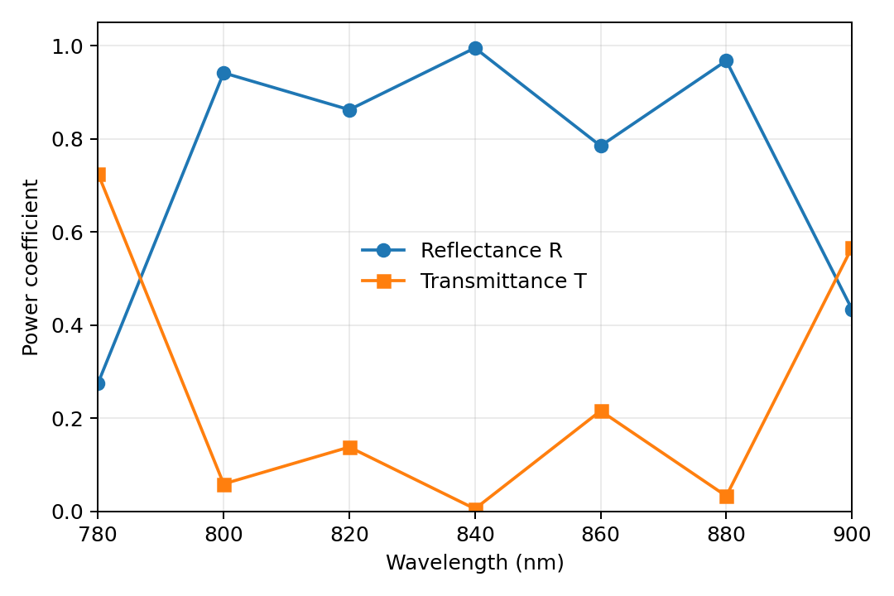
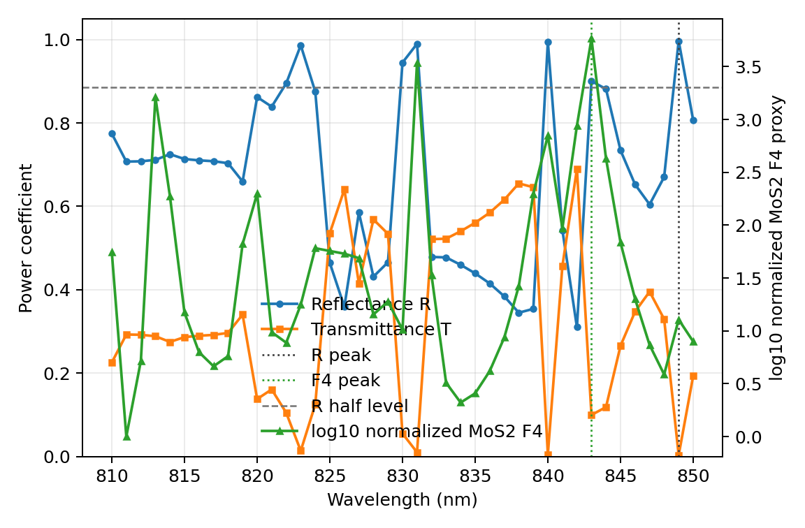
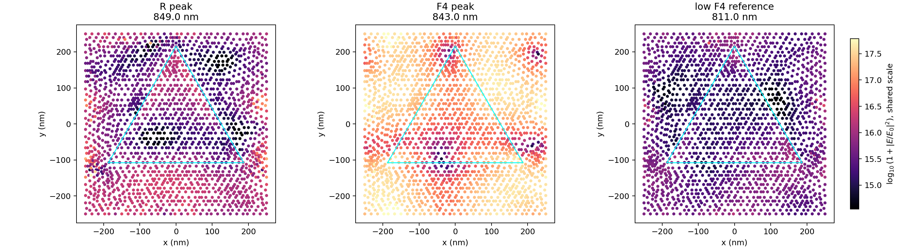
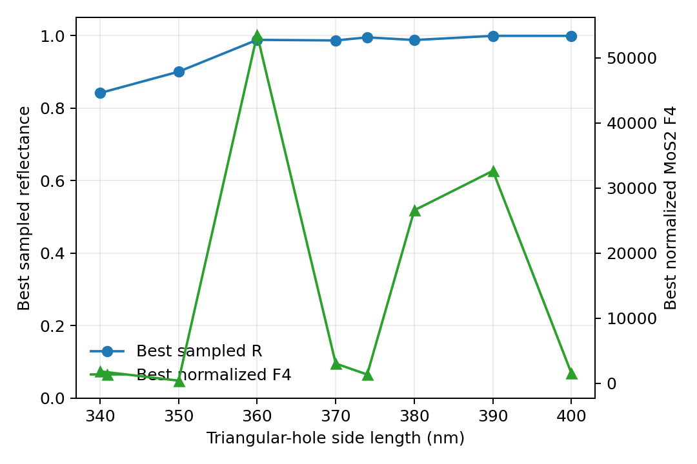
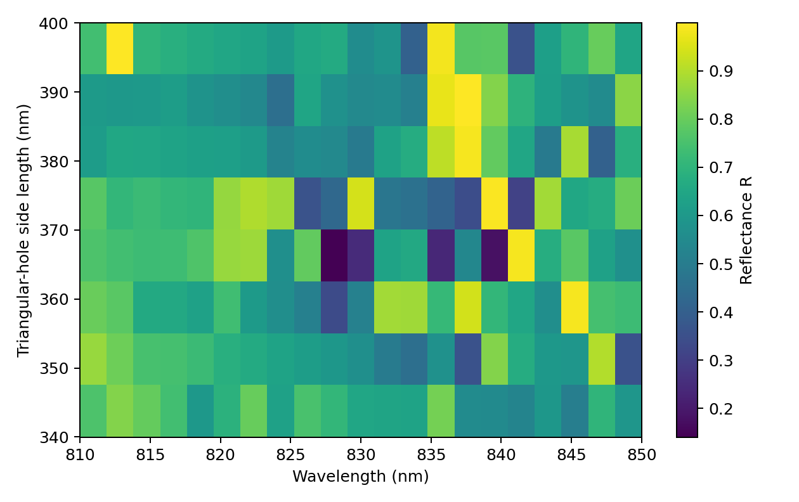
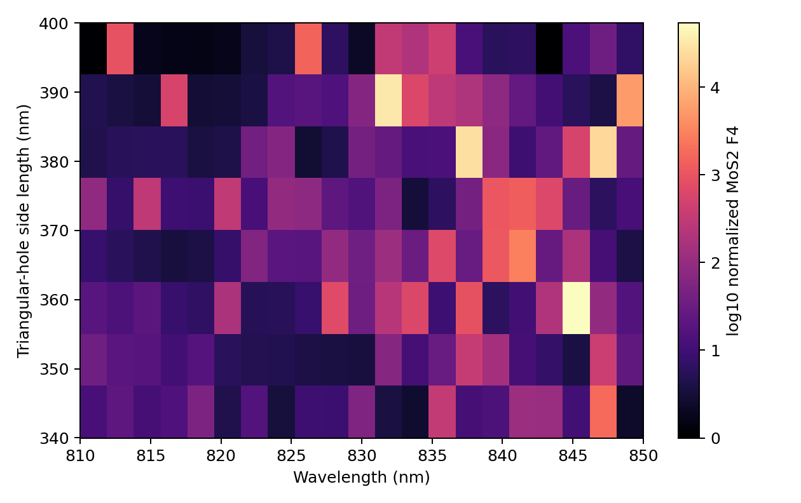
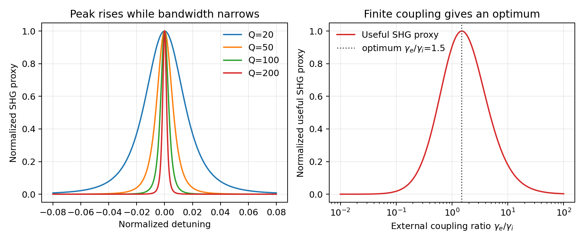
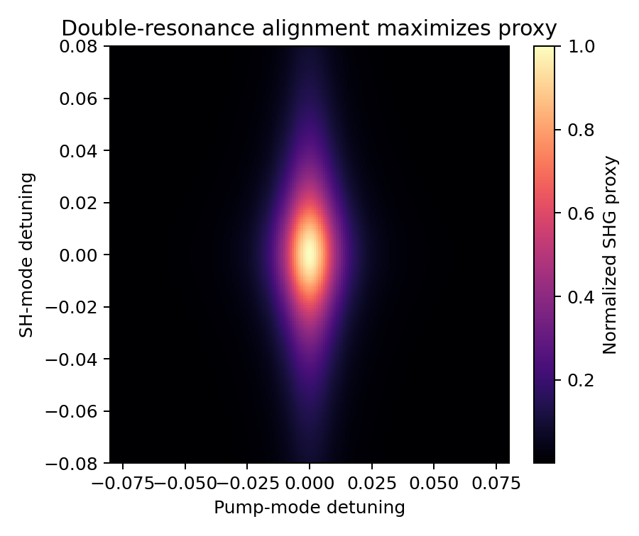
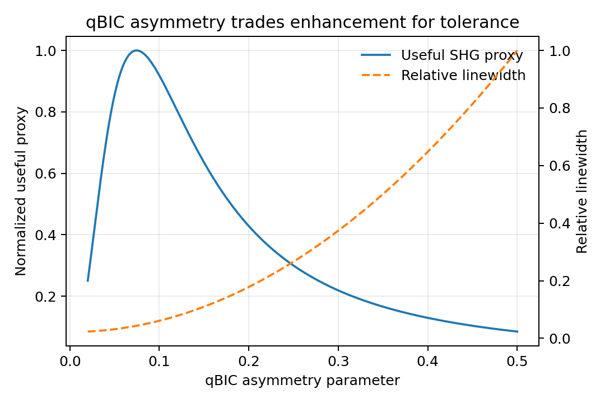

# 超薄 3R-MoS2 范德华超表面中二次谐波共振增强机制及其简化数值分析

**课程：** 低维材料  
**姓名：** （请填写）  
**学号：** （请填写）  
**日期：** 2026 年 6 月

## 摘要

二维过渡金属硫族化合物（transition metal dichalcogenides, TMDs）具有强烈的光与物质相互作用和可观的二阶非线性响应，是低维材料非线性光学中的重要体系。然而，原子级或纳米级厚度也使其有效相互作用长度很短，导致实际二次谐波（second-harmonic generation, SHG）转换效率受到限制。近年来，3R-MoS2、WS2/MoS2 异质双层以及全范德华超表面为这一矛盾提供了新的解决路径：利用 Mie 共振、anapole 共振、准连续谱束缚态（quasi-bound state in the continuum, qBIC）和激子共振增强局域场，同时通过结构设计调控二倍频辐射出射。本文围绕“共振增强是否只是追求更高 Q 因子”这一问题，梳理二维 TMD 非线性增强路线，从外部超表面增强单层 TMD、TMD 自身作为高折射率谐振器，到 3R-MoS2 qBIC 超表面和 WS2/MoS2 界面 SHG。进一步地，本文使用 Python-mph 脚本构建 qBIC-inspired 超薄 3R-MoS2 三角孔单胞的简化 COMSOL 教学模型，得到反射/透射谱、反射谱宽度代理 Q、MoS2 域内 \(F_4=\langle |E/E_0|^4\rangle\) 代理量和三角孔尺寸敏感性结果；同时用时间耦合模理论（temporal coupled-mode theory, TCMT）说明 Q 因子、外耦合、带宽和加工容差之间的折中。结果表明，线性反射峰与 MoS2 域内非线性源强代理峰并不必然重合；共振增强 SHG 的关键也不是无限增大 Q，而是在材料非线性、局域场增强、二倍频出射效率、吸收损耗、带宽和结构容差之间寻找最优平衡。

**关键词：** 低维材料；3R-MoS2；二次谐波；范德华超表面；qBIC；anapole；COMSOL；时间耦合模理论

## 1. 引言

非线性光学研究介质极化强度对外加电场的非线性响应。对于二阶非线性过程，材料极化可写为

$$
P(2\omega)=\varepsilon_0 \chi^{(2)}:E(\omega)E(\omega).
$$

其中 `chi^(2)` 是二阶非线性极化率，`E(omega)` 是基频光场。二次谐波产生（SHG）把频率为 `omega` 的两个光子转化为频率为 `2omega` 的光子，是表征材料反演对称性、晶体取向、界面结构和光场局域的重要手段。低维材料课程中的固体光学性质、反射与透射、Raman/非线性光谱、超快光学和低维材料光学测量，都与这一过程密切相关。

二维 TMD（如 MoS2、WS2、WSe2）因其层状晶体结构、强激子效应和强光吸收而成为低维材料光学研究的代表体系。单层 TMD 通常缺少反演对称性，因此可以产生强 SHG；但它们的厚度只有原子量级，光在材料中的相互作用长度极短。换言之，二维材料具有“大非线性系数”和“小有效体积”这两个相反特征：前者有利于强非线性，后者限制实际转换效率。如何在不牺牲二维材料优势的情况下增强光场与材料的相互作用，是当前二维非线性光学的重要问题。

纳米光子学提供了一条自然路径：把二维或层状 TMD 与光学谐振结构结合，让基频场在材料内部或界面附近被局域增强。早期方法多把单层 TMD 放在外部介质超表面上；后续研究发现，TMD 本身具有较高折射率，也可以被图案化为 Mie 或 anapole 谐振器。近两年，3R 堆垛 MoS2 更进一步成为核心平台：与常见 2H 堆垛不同，3R-MoS2 在多层或块体中仍保持非中心对称，因而可以同时提供较大的体相二阶非线性和高折射率谐振结构。2025 年报道的超薄 3R-MoS2 qBIC 超表面则把这一思想推向了 20-25 nm 量级的范德华超表面。

本文关注的问题是：共振增强 SHG 是否只是“Q 因子越高越好”？本文的回答是否定的。高 Q 可以提高储能和局域场，但也会压缩带宽、降低外耦合、增强对几何误差和材料吸收的敏感性。真实器件设计应寻找局域场增强、二倍频出射、带宽和工艺容差之间的平衡。

## 2. 非线性光学基础与课程联系

在经典非线性光学中，介质极化强度可展开为

$$
P=\varepsilon_0\left[\chi^{(1)}E+\chi^{(2)}E^2+\chi^{(3)}E^3+\cdots\right].
$$

线性项 `chi^(1)` 决定折射率、吸收、反射和透射等普通光学性质；二阶项 `chi^(2)` 则对应 SHG、和频、差频、光整流等过程。对于具有反演对称性的体材料，偶阶非线性极化在电偶极近似下通常消失。因此，SHG 对材料的对称性非常敏感。单层 TMD 或 3R 堆垛 TMD 的非中心对称结构可以产生显著 SHG，而 2H 堆垛的偶数层或块体中，层间反演关系会使体相二阶响应部分抵消。

低维材料中 SHG 的强弱不只由 `chi^(2)` 决定。实际可探测信号还受到局域场、模式体积、辐射出射效率和吸收损耗影响。一个简化的趋势关系可以写成

$$
I_{2\omega}\propto |\chi_{\mathrm{eff}}^{(2)}|^2 F_{\omega}^{2}F_{2\omega}\eta_{\mathrm{out}}.
$$

其中 `F_omega` 表示基频局域场增强，`F_2omega` 表示二倍频处的模式或辐射增强，`eta_out` 表示二倍频光能否有效耦合到远场。这一表达式虽然简化，但有助于统一理解 Mie 共振、anapole 共振、qBIC、激子共振和界面 SHG。

从课程内容看，本文主题连接了多个模块。反射与透射谱可以用于识别谐振模式；非线性光学给出 SHG 的基本选择定则；低维材料光学测量则关注如何从薄层材料中提取可观信号；固体物理中的晶体对称性和能带/激子结构则解释 2H、3R 堆垛以及 WS2/MoS2 异质界面的差异。

## 3. 文献综述：二维 TMD SHG 增强的路线演化

二维 TMD 非线性增强路线不宜按论文年份简单罗列，而应按技术路线演化理解。表 1 总结了本文使用的代表性文献及其作用。

**表 1 代表性文献及其在本文中的作用**

| 用途 | 文献 | 作用 |
|---|---|---|
| 背景综述 | Zeng et al., Frontiers of Physics, 2024 | 综述二维异质结构非线性光学、调控和表征，为本文提供背景 |
| 机制主案例 | Zograf et al., Nature Photonics, 2024 | 说明 3R-MoS2 nanodisk 中 anapole 共振和材料非线性协同增强 SHG |
| 主仿真案例 | Zograf et al., Communications Physics, 2025 | 提供超薄 3R-MoS2 三角孔 qBIC 超表面的几何参数和物理图像 |
| 对照案例 | Tognazzi et al., Light: Science & Applications, 2025 | 说明 WS2/MoS2 界面破缺对称性、anapole 和激子共振协同增强 SHG |
| 应用展望 | Peng et al., Nature Photonics, 2025 | 展示 3R-MoS2 non-local metasurface 在高效率集成 SHG 方向的潜力 |
| 背景路线 | Verre et al., Nature Nanotechnology, 2019 | 证明 TMD 可作为高折射率 Mie nanoresonator |
| 背景路线 | Bernhardt et al., Nano Letters, 2020 | 代表外部 quasi-BIC 介质超表面增强单层 WS2 SHG 的路线 |
| 背景路线 | Busschaert et al., ACS Photonics, 2020 | 代表 TMD resonator 增强 SHG 的早期探索 |
| 背景路线 | Nauman et al., Nature Communications, 2021 | 说明 MoS2 metasurface 中 Mie 模式可调控非线性发射方向 |
| 方法综述 | Huang et al., Advanced Functional Materials, 2024 | 将 SHG 增强策略归纳为对称性破缺和光-物质相互作用增强 |

### 3.1 外部超表面增强单层 TMD

最早的思路是把二维材料作为强非线性但极薄的“活性层”，放置在外部介质或金属纳米结构附近。外部谐振器负责增强局域场，二维材料负责提供 `chi^(2)`。Bernhardt 等关于 WS2 monolayer + quasi-BIC metasurface 的工作就是这一思路的代表。它说明高 Q 介质超表面可以显著提高单层 TMD 的 SHG，但材料本身仍是贴附在外部结构上的非线性层。

### 3.2 TMD 自身作为高折射率谐振体

第二条路线是让 TMD 自身成为谐振器。Verre 等证明 TMD 纳米盘可以作为高折射率 Mie nanoresonator，这改变了“二维材料只是被动贴片”的理解。随后，TMD 被图案化成 nanoresonator 或 metasurface，用 ED、MD、MQ 等模式调控 SHG/THG 的方向和效率。Nauman 等的 MoS2 metasurface 工作表明，TMD 本身可以同时承担高折射率光学结构和非线性源的角色。

### 3.3 3R-MoS2：非中心对称体相与谐振结构的结合

3R-MoS2 是近两年最适合作为课程论文主线的平台。其关键优势有三点。第一，3R 堆垛在多层和块体中仍然缺少反演对称性，体相 `chi^(2)` 不会像 2H 偶数层那样相互抵消。第二，MoS2 在近红外具有较高折射率，可以形成 Mie/anapole/qBIC 模式。第三，范德华材料可被制备成超薄纳米结构，为集成非线性光源提供可能。

Zograf 等 2024 年的 3R-MoS2 nanodisk 工作说明，anapole 共振可以在远场散射较弱的同时增强内部场，从而提高 SHG。2025 年 Communications Physics 的 ultrathin 3R-MoS2 metasurface 则进一步把厚度降至约 20-25 nm，通过三角孔阵列形成 qBIC 模式。本文的 COMSOL 模型参考这一结构参数进行 qBIC-inspired 简化分析。

### 3.4 WS2/MoS2 界面 SHG 与激子共振

WS2/MoS2 hetero-bilayer nanoantenna 是本文的对照案例。它与 3R-MoS2 的增强机制不同：3R-MoS2 主要利用体相非中心对称和 qBIC/anapole 场增强，而 WS2/MoS2 异质双层强调界面破缺对称性、界面处局域场以及激子共振。若 SHG 主要来自界面，则体积分型代理量并不充分，应该关注界面面上的 `|E|^4` 或界面源项。这一对照有助于说明“材料非线性来源”本身也是可设计自由度。

## 4. 物理机制：Mie、anapole、qBIC 与最优 Q 因子

Mie 共振来自高折射率纳米结构中电偶极、磁偶极和高阶多极模式。它的优点是模式体积较小、局域场增强明显。Anapole 模式可以理解为电偶极和环形偶极远场相消的一种非辐射或弱辐射模式；它的远场散射可能出现谷值，但结构内部场很强。因此，在 SHG 中，anapole 的意义不是简单提高远场散射，而是提高材料内部的基频场。

qBIC 则来自连续谱束缚态在有限结构扰动下的泄露版本。理想 BIC 不向外辐射，Q 因子趋于无穷，但也难以从外部激发和提取能量。实际 qBIC 通过破缺对称性或有限尺寸使模式弱耦合到远场，从而兼具高储能和可激发性。对于 SHG，这种性质很有吸引力：基频处高 Q 可以增强场，二倍频处还需要适当辐射通道把信号带到远场。

因此，最大 Q 不等于最大可用 SHG。若 Q 过高，模式带宽变窄，对入射波长、角度、温度、应变和加工误差极其敏感；同时外耦合不足会使泵浦难以进入模式，也会影响二倍频出射。若 Q 过低，局域场增强不足。最优设计应在以下因素间折中：

- 材料 `chi^(2)` 或界面 `chi_s^(2)`；
- 基频局域场增强；
- 二倍频辐射出射效率；
- 吸收损耗；
- 带宽；
- 加工容差；
- 与激子或材料色散峰的匹配。

## 5. COMSOL 简化数值分析

### 5.1 模型与方法

本文使用 Python `mph` 包直接脚本化控制 COMSOL 6.3，未使用 COMSOL GUI。模型输出均由脚本生成。主模型为 qBIC-inspired 3R-MoS2 三角孔单胞，几何参数如下：

- 周期：500 nm；
- 3R-MoS2 薄膜厚度：25 nm；
- 三角孔边长：374 nm；
- 上方为空气层；
- 下方为 SiO2 基底；
- 横向边界为 Floquet 周期边界；
- 上下边界使用周期端口；
- 扫描波长范围为 780-900 nm。

审计后模型对三角孔区域作了关键修正：MoS2 薄膜先减去三角孔，同时保留与孔同形状的三角空气填充域，并把该域与上方空气层共同赋予空气材料。COMSOL 默认的 `wee1` 波方程保持为 material-controlled 全域特征，不再额外叠加手动的 SiO2/MoS2 wave equation feature；空气、SiO2 和 MoS2 的介电常数由各自材料选择域控制。这样既避免了空气孔被错误地变成“求解域外边界”，也避免了多个波方程特征在同一材料域上重叠。材料参数采用简化、无色散的介电常数代理：空气 `epsilonr = 1`，SiO2 `epsilonr = 2.1025`，3R-MoS2 `epsilonr = 17.64`。这些参数用于教学级趋势分析，不用于声称对实验结果的定量复现。

为了避免把端口、尖角或全域数值极值误认为 SHG 增强，本文不再使用全域最大 `|E|^4` 作为主要指标，而是在 MoS2 域内定义两个线性场代理量：

$$
F_2=\langle |E_{\omega}/E_0|^2\rangle_{\mathrm{MoS_2}},
\qquad
F_4=\langle |E_{\omega}/E_0|^4\rangle_{\mathrm{MoS_2}}.
$$

其中 \(F_4\) 只表示基频场对 SHG 源强的趋势代理，不等同于真实二倍频转换效率。

### 5.2 反射与透射谱

图 1 给出 780-900 nm 的粗略反射/透射谱。模型在 800、840 和 880 nm 附近出现明显反射增强和透射压低，说明该简化几何存在多个窄带光学特征。由于模型为无吸收代理模型，计算中 \(R+T\) 基本保持为 1。

进一步在 810-850 nm 进行 1 nm 步长细扫，得到图 2。采样结果显示，849 nm 处反射率约为 0.997；按反射峰半高宽线性插值估算，\(\mathrm{FWHM}\approx 27.75\ \mathrm{nm}\)，\(Q\approx 30.6\)。谱线中存在多个尖锐特征和数值敏感性，因此这里的 Q 只能作为反射谱宽度代理量，不能写成对原文 qBIC 高 Q 模式的定量复现。

图 2 中同时绘制了 MoS2 域内的归一化 \(F_4\) 代理量。它与反射峰并不完全同步：849 nm 是本次细扫中的反射峰，而 MoS2 域内 \(F_4\) 代理量峰值出现在 843 nm。也就是说，“线性反射最强”不必然等于“材料域内非线性源代理最大”。这也是本文采用域内代理量而不是全域最大场的原因。

为检查场增强是否出现在薄膜区域，图 3 对比了三个采样点的薄膜中面近场：849 nm 反射峰、843 nm \(F_4\) 代理峰和 811 nm 低 \(F_4\) 对照点。三幅图使用统一色标绘制 \(\log_{10}(1+|E/E_0|^2)\)，三角轮廓标出了空气孔位置。该图的重点不是给出真实 SHG 转换效率，而是说明 843 nm 的材料域内场代理峰比单纯反射峰更贴近非线性源强分析。

### 5.3 三角孔边长敏感性

为回应“结构参数不只是 Q 越大越好”的问题，本文对三角孔边长进行了扩展敏感性扫描。边长取 340、350、360、370、374、380、390 和 400 nm，并在 810-850 nm 以 2 nm 步长采样，共得到 168 个 `(边长, 波长)` 点。扫描同时记录每个边长下的最佳反射点和最佳 \(F_4\) 点，而不是只按反射率选点。

图 5 和图 6 进一步给出完整网格的反射热图和归一化 \(F_4\) 热图。结果显示，部分边长下最佳反射点和最佳 \(F_4\) 点重合，例如 360 nm；但也有明显不重合的情况，例如 340 nm 的最佳反射在 812 nm，而最佳 \(F_4\) 在 848 nm。390 nm 边长在采样网格中出现接近 0.999 的反射峰，但最佳 \(F_4\) 对应波长在 832 nm。由此可见，当前简化模型中响应具有多峰和采样依赖特征，不能简单声称 374 nm 是唯一最优结构。更稳妥的结论是：三角孔尺寸会显著改变窄带响应和薄膜内场增强，真实器件还必须进一步考虑圆角、侧壁角、周期、厚度、材料色散和网格收敛。

### 5.4 基础路线：3R-MoS2 nanodisk anapole

3R-MoS2 nanodisk anapole 路线在本文中不作为主 COMSOL 建模对象，而作为机制解释保留。其核心物理图像是：anapole 模式的远场散射可以较弱，但内部场增强显著，因此 SHG 不一定与线性散射峰一一对应。对于课程论文而言，这一案例补充了 qBIC 的理解：二者都强调“储能/局域场”与“辐射/出射”之间的分离。

## 6. Python TCMT 分析

COMSOL 给出具体结构的线性响应，而 TCMT 用于解释为什么高 Q 不是唯一目标。单模 TCMT 中，基频谐振模振幅可写成

$$
a(\omega)=\frac{\sqrt{2\gamma_e}s_{\mathrm{in}}}{i(\omega_0-\omega)+\gamma_e+\gamma_i}.
$$

其中 `gamma_e` 是外耦合损耗，`gamma_i` 是吸收或内禀损耗。若 SHG 代理量近似与 `|a|^4` 成正比，则增大 Q 会提高峰值并压窄带宽。图 7 左侧展示了不同 Q 下的归一化 SHG 代理曲线；Q 越大，峰越尖锐，带宽越窄。图 7 右侧改用外耦合比 \(\gamma_e/\gamma_i\) 作横轴：外耦合太弱时泵浦难以进入模式，外耦合太强时总损耗变大、场增强下降，因此“可用 SHG”代理量在中间区域出现最优值。本模型参数下最优外耦合比约为 1.49，这一图像比单纯讨论 loaded Q 更能说明“最大 Q 不等于最大可用 SHG”。

若考虑双共振结构，即基频和二倍频处都存在模式，则 SHG 还取决于两个模式是否同时对准。图 8 给出泵浦模式失谐和二倍频模式失谐的二维图。当二者同时接近零失谐时，SHG 代理量最大。这支持“双共振设计”的改进建议：不仅要在 `omega` 处增强泵浦场，也要考虑 `2omega` 处的辐射或激子增强。

qBIC 的非对称参数也体现类似折中。理想 BIC 辐射损耗极低，但难以激发；增加非对称性会增强外耦合，同时降低 Q、增大线宽。图 9 的归一化模型显示，随着非对称参数变化，可用 SHG 代理量存在最佳区间，而相对线宽同步变化。这说明 qBIC 设计应考虑加工容差，而不是只追求最窄谱线。

## 7. WS2/MoS2 界面 SHG 对照

3R-MoS2 qBIC 超表面的主要非线性来源是体相非中心对称；而 WS2/MoS2 hetero-bilayer nanoantenna 的核心是界面破缺对称性。对于后者，非线性源更接近二维界面源：

$$
P_s(2\omega)=\varepsilon_0\chi_s^{(2)}:E_{\parallel}(\omega)E_{\parallel}(\omega).
$$

因此，若比较两类结构，3R-MoS2 可以使用体域中的 `∫|E|^4 dV` 或其代理量，而 WS2/MoS2 更应关注界面上的 `∫_interface |E_parallel|^4 dS`。这一差异说明，非线性增强不只是“光学模式设计”，也包括“非线性源所在空间位置”的设计。界面 SHG、激子共振和 anapole 模式可以协同工作，但也会引入吸收增强和温度/应变敏感性，这与 3R-MoS2 qBIC 的体相路线形成互补。

## 8. 改进方案与局限

### 8.1 双共振设计

当前 COMSOL 模型主要分析基频附近的线性共振趋势。进一步优化应同时设计 `omega` 和 `2omega` 两个频率：在基频处提高局域场，在二倍频处提高出射效率。TCMT 失谐图已经说明，双共振对准时 SHG 代理量最大。

### 8.2 稳健 Q 设计

三角孔边长扫描表明，局域场和反射响应对几何参数敏感。后续可扩展扫描周期、厚度、圆角半径和侧壁角，寻找增强峰值、带宽和加工容差之间的 Pareto 最优。对于课程论文而言，这一讨论体现了分析深度：最优设计不是最大 Q，而是可制造、可激发、可出射的合适 Q。

### 8.3 材料-结构协同

3R-MoS2、WS2/MoS2 界面和 non-local 3R-MoS2 metasurface 代表不同材料-结构协同方式。3R-MoS2 的优势是体相非中心对称和高折射率；WS2/MoS2 的优势是界面源项和激子增强；non-local metasurface 则指向集成非线性光源。未来设计应把材料堆垛、界面、激子和谐振模式作为共同可调自由度。

### 8.4 本文局限

本文模型是课程论文层面的简化趋势分析，存在以下局限：

- MoS2 和 SiO2 使用无色散、无吸收的简化介电常数；
- COMSOL 结果是线性光学响应，未求解完整非线性 Maxwell 方程；
- \(F_4\) 是 MoS2 域内线性场四次方平均代理量，不是真实 SHG 转换效率；
- Q 因子由 1 nm 步长反射谱的半高宽估算，谱线存在多峰和数值敏感性；
- 参数扫描只覆盖三角孔边长与 810-850 nm 波段，尚未扩展到周期、厚度、圆角半径和侧壁角；
- 本文尚未完成系统网格收敛检查，近场尖角附近的局域极值只能作为定性诊断；
- nanodisk anapole 和 WS2/MoS2 界面 SHG 未做完整三维建模，而作为机制和对照讨论保留。

这些局限不影响本文的主要课程论文结论：共振增强 SHG 的核心是材料非线性与光场局域/出射的协同，设计目标应是综合优化而非单一追求最大 Q。

## 9. 结论

本文围绕二维范德华材料超表面中的共振增强 SHG，梳理了从外部超表面增强单层 TMD、TMD 自身作为高折射率谐振器，到 3R-MoS2 qBIC 超表面和 WS2/MoS2 界面 SHG 的技术路线。3R-MoS2 的特殊性在于其 3R 堆垛保持体相非中心对称，同时具有较高折射率，适合直接图案化为非线性谐振结构。

通过纯 Python `mph` 脚本控制 COMSOL，本文构建了 qBIC-inspired 超薄 3R-MoS2 三角孔单胞的教学级趋势模型，并修正了三角孔空气域缺失和波方程域重叠风险。修正后的模型获得反射/透射谱、反射谱宽度代理 Q、MoS2 域内 \(F_2/F_4\) 场增强代理量、近场采样图和三角孔边长敏感性结果。细扫结果在 849 nm 附近出现强反射采样点，粗略 \(Q\approx 30.6\)，但 MoS2 域内 \(F_4\) 代理峰出现在 843 nm；这说明线性反射峰和非线性源代理峰不能简单等同。三角孔边长扫描进一步显示响应具有明显尺寸敏感性和多峰特征，不能简单把某一个边长称为全局最优。TCMT 模型进一步表明，高 Q 会提高峰值但压缩带宽，有限吸收、外耦合和 qBIC 非对称参数会共同决定实际可用 SHG。因此，二维 TMD 非线性超表面的设计目标不是无限提高 Q，而是在局域场增强、二倍频出射、吸收、带宽和加工容差之间寻找最优平衡。

## 参考文献

[1] Zeng, Y., et al. Nonlinear optics of two-dimensional heterostructures. *Frontiers of Physics*, 2024. https://link.springer.com/article/10.1007/s11467-023-1363-6

[2] Zograf, G., et al. Combining ultrahigh index with exceptional nonlinearity in resonant 3R-MoS2 nanodisks. *Nature Photonics*, 2024. https://www.nature.com/articles/s41566-024-01444-9

[3] Zograf, G., et al. Ultrathin 3R-MoS2 metasurfaces with atomically precise edges for efficient nonlinear nanophotonics. *Communications Physics*, 2025. https://www.nature.com/articles/s42005-025-02194-y

[4] Tognazzi, A., et al. Interface second harmonic generation enhancement in bulk WS2/MoS2 hetero-bilayer van der Waals nanoantennas. *Light: Science & Applications*, 2025. https://www.nature.com/articles/s41377-025-01983-y

[5] Peng, R., et al. 3R-stacked transition metal dichalcogenide non-local metasurface for efficient second-harmonic generation. *Nature Photonics*, 2025. DOI: 10.1038/s41566-025-01781-3.

[6] Verre, R., et al. Transition metal dichalcogenide nanodisks as high-index dielectric Mie nanoresonators. *Nature Nanotechnology*, 2019. DOI: 10.1038/s41565-019-0442-x.

[7] Bernhardt, N., et al. Quasi-BIC resonant enhancement of second-harmonic generation in WS2 monolayers. *Nano Letters*, 2020. https://pubs.acs.org/doi/10.1021/acs.nanolett.0c01603

[8] Busschaert, S., et al. Transition metal dichalcogenide resonators for second harmonic signal enhancement. *ACS Photonics*, 2020.

[9] Nauman, M., et al. Tunable unidirectional nonlinear emission from transition-metal-dichalcogenide metasurfaces. *Nature Communications*, 2021. https://www.nature.com/articles/s41467-021-25717-x

[10] Huang, L., et al. Control of second-harmonic generation in two-dimensional layered materials. *Advanced Functional Materials*, 2024.
